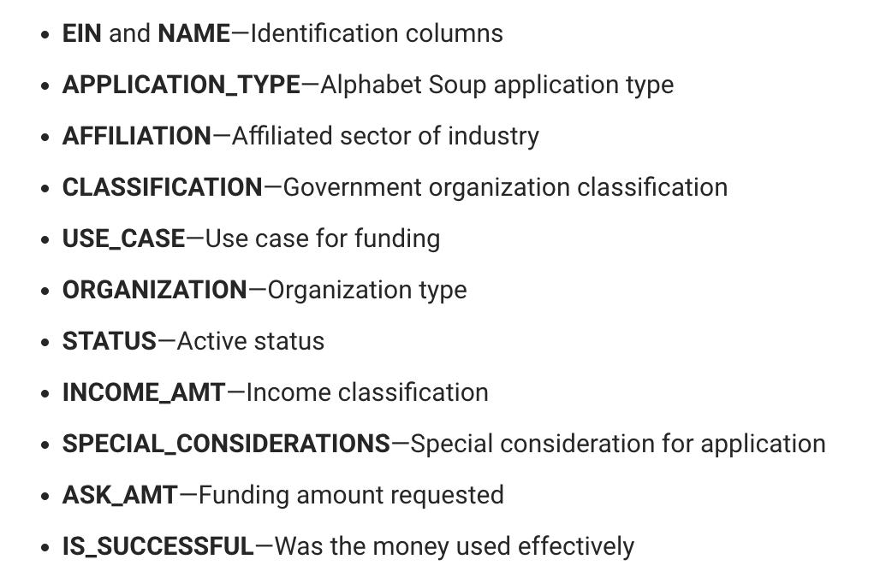

# Neural Network Charity Analysis

## Overview

In this analysis, we attempted to create a deep learning neural network to help classify and predict the success of applicants seeking funding from Alphabet Soup, a non-profit foundation, at using grants effectively.  Alphabet Soup provided a data set containing metadata of over 34,000 organizations that received funding from Alphabet Soup over the years.  This data set was used to train and test the effectivity of an initial neural network and several modifications attempting to optimize performance.

## Results

### Data Preprocessing

Data preprocessing is a necessary step for neural network design.  In a preprocessing phase, we review the initial metadata structure shown below to determine which variables a potential targets and potential features.



Following this initial review, it is determined that the fields specific to each row of data, 'EIN' and 'NAME', should be removed from the analysis.  
The fields, 'IS_SUCCESSFUL' is the target, and the remaining fields are potential features.

### Compiling, Training, and Evaluating the Model

#### **Initial Model:**

In the initial analysis, we created a training model with 2 layers, a total of 110 neurons, and the `relu` activation function:

```
# Define the model - deep neural net, i.e., the number of input features and hidden nodes for each layer.
number_input_features = len(X_train[0])
hidden_nodes_layer1 = 80
hidden_nodes_layer2 = 30

nn = tf.keras.models.Sequential()

# First hidden layer
nn.add(
    tf.keras.layers.Dense(units=hidden_nodes_layer1, input_dim=number_input_features, activation="relu")
)

# Second hidden layer
nn.add(tf.keras.layers.Dense(units=hidden_nodes_layer2, activation="relu"))

# Output layer
nn.add(tf.keras.layers.Dense(units=1, activation="sigmoid"))

# Check the structure of the model
nn.summary()
```

I started with 2 layers knowing that a single layer would only be sufficient for a very simple problem and hoping that 2 layers could be sufficient.  I knew that additional layers could be added and evaluated during optimization.  Across the 2 layers, I added a total of 110 neurons (80 in the first layer and 30 in the second).  This is between the recommendation of 2-3 times the number of input variables - we have a total of 44 input variables in our model.  I utilized the `relu` activation function because if the data were able to be evaluated with a linear regression, `relu` would be a good starting point.

Unfortunately, with this initial model, I was only able to achieve an accuracy of about 72.5%:


#### **Optimization Attempts**

Given that the initial attempt did not perform at the desired level, I went back to the beginning and took a closer look at the fields in the intial file.  In our initial analysis we only review the value counts for application type and classification, which both had more than 10 unique values per field.  This time, I reviewed all fields.  During my review I noticed that both AFFILIATION and USE_CASE had values which might be considered outliers:


In both cases, I felt it would help to group together the values that occured less often:

```
application_df.AFFILIATION = application_df.AFFILIATION.replace("Family/Parent","Other")
application_df.AFFILIATION = application_df.AFFILIATION.replace("National","Other")
application_df.AFFILIATION = application_df.AFFILIATION.replace("Regional","Other")
```

```
application_df.USE_CASE = application_df.USE_CASE.replace("CommunityServ","Other")
application_df.USE_CASE = application_df.USE_CASE.replace("Heathcare","Other")
```

I also noticed that the vast majority of the 34,000 records had a SPECIAL_CONSIDERATION value of 'N' and that the vast majority of the records had a STATUS value of '1'.  I thought it was possible that these columns were not able to add effectively to the analysis, so I dropped them:


Following these actions on the input columns, I attempted three different variations on deep learning models, but I was never able to improve the accuracy above 73%.

In the first trial, I reduced both the number of neurons and the number of epochs, because I noticed during the original training that the performance of 72% accuracy was achieved early in training.  
```
# Trial 1
# Define the model - deep neural net, i.e., the number of input features and hidden nodes for each layer.
number_input_features = len(X_train[0])
hidden_nodes_layer1 = 80
hidden_nodes_layer2 = 30

nn = tf.keras.models.Sequential()

# First hidden layer
nn.add(
    tf.keras.layers.Dense(units=hidden_nodes_layer1, input_dim=number_input_features, activation="relu")
)

# Second hidden layer
nn.add(tf.keras.layers.Dense(units=hidden_nodes_layer2, activation="relu"))


# Output layer
nn.add(tf.keras.layers.Dense(units=1, activation="sigmoid"))
```

I thought perhaps the additional neurons and epochs were resulting in over-fitting.  These were the results:


In the second trial, I added a third layer, thinking that perhaps the data was more complex and needed an additional analytical step.  

```
# Trial 2 - add a 3rd layer and reduce number of neurons
# Define the model - deep neural net, i.e., the number of input features and hidden nodes for each layer.
number_input_features = len(X_train[0])
hidden_nodes_layer1 = 30
hidden_nodes_layer2 = 20
hidden_nodes_layer3 = 10

nn = tf.keras.models.Sequential()

# First hidden layer
nn.add(
    tf.keras.layers.Dense(units=hidden_nodes_layer1, input_dim=number_input_features, activation="relu")
)

# Second hidden layer
nn.add(tf.keras.layers.Dense(units=hidden_nodes_layer2, activation="relu"))

# Third hidden layer
nn.add(tf.keras.layers.Dense(units=hidden_nodes_layer3, activation="relu"))

# Output layer
nn.add(tf.keras.layers.Dense(units=1, activation="sigmoid"))
```

These were the results:


In the third trial, I thought that perhaps the data was not linear and therefore a different activation function might be needed.  I decided to try the `tanh` function on the second and third layers, but as you will see, I did not achieve a significantly different result:

```
# Trial 3 - try a different activation function
# Define the model - deep neural net, i.e., the number of input features and hidden nodes for each layer.
number_input_features = len(X_train[0])
hidden_nodes_layer1 = 30
hidden_nodes_layer2 = 20
hidden_nodes_layer3 = 10

nn = tf.keras.models.Sequential()

# First hidden layer
nn.add(
    tf.keras.layers.Dense(units=hidden_nodes_layer1, input_dim=number_input_features, activation="relu")
)

# Second hidden layer
nn.add(tf.keras.layers.Dense(units=hidden_nodes_layer2, activation="tanh"))

# Third hidden layer
nn.add(tf.keras.layers.Dense(units=hidden_nodes_layer3, activation="tanh"))

# Output layer
nn.add(tf.keras.layers.Dense(units=1, activation="sigmoid"))
```

These were the results:


## Summary

I feel that I needed additional information from experts within Alphabet Soup about what types of factors they felt generally resulted in more successful outcomes. I was not achieving the predictive accuracy that I would have liked without such input.  I also considered that perhaps deep learning was 'overkill' for this data scenario.  Perhaps a vector machine or a random forest model would be simpler and more effective for this data.  Because the data is tabular (not image or natural language) either model is able to be evaluated as a potential solution.  Both should be evaluated along with spending time with subject matter experts to better understand the input factors.


